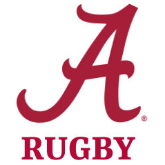

<html lang="en">
<head>
  <meta charset="UTF-8" />
  <meta name="viewport" content="width=device-width, initial-scale=1.0" />
  <title>Auburn University Rugby Football Club</title>
  <link href="https://fonts.googleapis.com/css2?family=Roboto:wght@400;700&display=swap" rel="stylesheet">

</head>
<body>
  <header>
    <h1>Auburn University Rugby Football Club</h1>
    
War Damn Rugby!

  </header>
  <nav>
    <a href="#match-schedule">Match Schedule</a>
    <a href="#training-schedule">Training</a>
    <a href="#coaching-staff">Coaches</a>
    <a href="#officers">Officers</a>
    <a href="#roster">Roster</a>
    <a href="#contact">Contact</a>
  </nav>

<section id="match-schedule">
  <h2>Fall 2025 Match Schedule</h2>
  <table>
    <thead>
      <tr>
        <th>Date</th>
        <th>Opponent</th>
        <th>Location</th>
      </tr>
    </thead>
    <tbody>
      <tr>
        <td>Saturday, September 20, 2025</td>
        <td>
          
          University of Kentucky
        </td>
        <td>Away</td>
      </tr>
      <tr>
        <td>Saturday, September 27, 2025</td>
        <td>
          
          University of Alabama
        </td>
        <td>Home</td>
      </tr>
      <tr>
        <td>Saturday, October 4, 2025</td>
        <td>
          
          Louisiana State University
        </td>
        <td>Away</td>
      </tr>
      <tr>
        <td>Saturday, October 25, 2025</td>
        <td>
          
          Kennesaw State University
        </td>
        <td>Home</td>
      </tr>
      <tr>
        <td>Saturday, November 1, 2025</td>
        <td>
          
          SCRC Playoff
        </td>
        <td>TBD</td>
      </tr>
      <tr>
        <td>Saturday, November 8, 2025</td>
        <td>
          
          SCRC Final
        </td>
        <td>TBD</td>
      </tr>
      <tr>
        <td>Saturday, November 15, 2025</td>
        <td>
          
          NCR Playoffs
        </td>
        <td>TBD</td>
      </tr>
      <tr>
        <td>Saturday, November 22, 2025</td>
        <td>
          
          NCR Playoffs
        </td>
        <td>TBD</td>
      </tr>
    </tbody>
  </table>
</section>

<section class="bg-white dark:bg-gray-900 py-12 px-4 sm:px-6 lg:px-8">
  

    <h2 class="text-3xl font-extrabold text-orange-600 dark:text-orange-400 mb-6">
      Training Schedule
    </h2>
    

      

        <h3 class="text-xl font-bold text-gray-800 dark:text-white mb-2">
          Tuesday & Thursday
        </h3>
        

          6:00 PM – 8:00 PM 
          <a
            href="https://www.google.com/maps/place/Auburn+University+Sportsplex/@32.5917557,-85.5038935,17z"
            target="_blank"
            rel="noopener noreferrer"
            class="text-blue-600 hover:underline"
          >
            Auburn University Sportsplex
          </a> 
          811 Lem Morrison Dr
        

      

      

        <h3 class="text-xl font-bold text-gray-800 dark:text-white mb-2">
          Wednesday
        </h3>
        

          6:00 PM – 7:00 PM 
          <a
            href="https://www.google.com/maps/place/Biggio+Dr,+Auburn,+AL+36832/@32.5988057,-85.4949093,17z"
            target="_blank"
            rel="noopener noreferrer"
            class="text-blue-600 hover:underline"
          >
            Intramural Fields, Biggio Dr
          </a>
        

      

    

  

</section>

  <section id="coaching-staff">
    <h2>Coaching Staff 2025</h2>
    
Coming soon...

  </section>

  <section id="officers">
    <h2>Executive Officers 2025</h2>
    
Coming soon...

  </section>

<section id="team-roster">
  <h2>Team Roster</h2>
  

    <!-- Player Card Example -->
    

      

        

          90
          Loose Forward
        

        

          
        

      

      

        <h3>Austin Kosco</h3>
        <ul>
          <li><strong>Height:</strong> 6'4"</li>
          <li><strong>Weight:</strong> 215 lbs</li>
          <li><strong>Major:</strong> Sports Exercise Science</li>
          <li><strong>Class:</strong> Senior</li>
          <li><strong>Hometown:</strong> Colorado Springs, CO</li>
        </ul>
      

    

    <!-- Add more cards below using same structure -->
  

</section>

  <section id="contact">
    <h2>Contact Information</h2>
    
Coming soon...

  </section>
</body>
</html>
